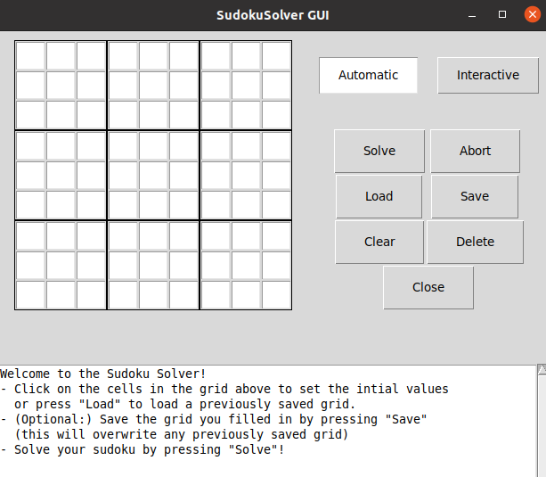

# SudokuSolver
Simple, lightweight and easy-to-use python program (with GUI) to solve sudokus.  
Both interactive and fully automatic solving modes are available.  
Version March 2021 (with documentation update in February 2024).

### Prerequisites
- Python (both 2.7 and 3.8 are tested to work, other versions might work as well but not guaranteed).
- Python modules: `numpy`, `itertools`, `os`, `sys`, `Tkinter`, `copy` (all except `numpy` are in the standard library).

### How to get the code running
- Clone or download the this repository onto your local computer. If you don't know how to do this, the easiest option is probably to click the green button that says ' Code ', then ' Download ZIP ', then move the downloaded zip file to wherever you want this program to be located, then unzip it using any unzipping tool. No further compilation or installation is required.
- Open a terminal and navigate to the ' SudokuSolver ' folder (depends on where you downloaded/moved/unzipped it) and run the program using the command `python sudokusolver.py` (or `python3 sudokusolver.py`). Alternatively, start your favorite python IDE and open and run the file `sudokusolver.py` in the ' SudokuSolver ' folder. Note that the folder might also be called ' SudokuSolver-master ' instead of ' SudokuSolver ' depending on how you downloaded the project.

### Tutorial
Running the script `sudokusolver.py` will pop up a window with an empty sudoku:

To fill a cell, simply click it and type the number that is supposed to go in it. In this way, fill all the cells whose content is known at the start. Alternatively, you can load a sudoku from a previously stored `.txt` file. For example, have a look at the file `fls/example2.txt`. It looks like this:

In other words, simply fill the numbers (separated by spaces) in a square grid, using `0` for cells that are empty in the original sudoku. You can load the file by pressing ' Load ' and selecting this file. Whether you fill the numbers by hand or by loading a `.txt` file, the result looks like this:

Then, click the ' Solve ' button. After a short time the sudoku will be solved:

You can check the textual output for some more information on the solving procedure.  

There is also an interactive mode which instead of solving the sudoku will show you hints. Starting from an unsolved sudoku, switch to interactive mode by clicking ' Interactive '. Now start solving the sudoku: either fill a cell by clicking on it and typing the correct number, or remove a candidate number for a given cell by clicking on it and then clicking on the candidate number in the line at the bottom (it should turn red). Click the ' Reduce ' button to make the program perform (only) the most basic operations for you and the ' Hint ' button whenever you need a new hint. For example, starting from the unsolved example sudoku used above, clicking the ' Hint ' button, will show you something like this:

### Solving methods
This program solves sudokus essentially like a person would, i.e. it does not use brute force or other guesswork, although such a method is implemented as a final backup option when deterministic methods are not able to solve the sudoku. For more information on the implemented methods, see e.g. [Kristanix](https://www.kristanix.com/sudokuepic/sudoku-solving-techniques.php) and [Learn-Sudoku](https://www.learn-sudoku.com/advanced-techniques.html).
